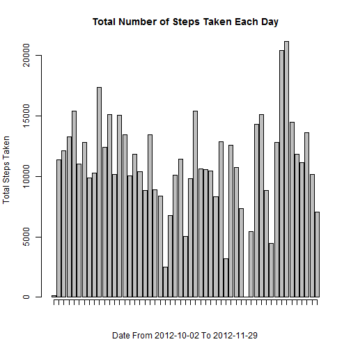
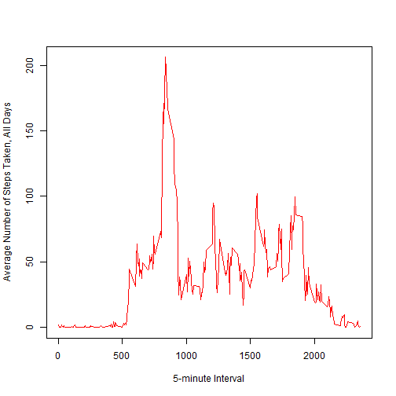

# Reproducible Research: Peer Assessment 1


## Loading and preprocessing the data
Set the working directory to the desired location, and make sure that `activity.zip` is available in that directory. After reading the data, it will be transformed into a format suitable for our analysis (column classes are changed).

```r
        if (file.exists("activity.zip")){
                unzip("activity.zip", "activity.csv")
        }
        
        if (file.exists("activity.csv")){
                data_input <- read.csv("activity.csv", colClasses = c("numeric", "character", "numeric"))
        data_input$date <- as.Date(data_input$date)
        } else print("activity.zip or activity.csv not found! ")
```


## What is mean total number of steps taken per day?
First we make a histogram of the total number of steps taken each day
by using the `aggregate` function. By using the date to subset and applying the `sum` function (for each day) we can obtain the number of steps taken per day. 

```r
        data_frame_input <- aggregate(steps ~ date, data = data_input, sum)
        data_frame_input$date <- as.Date(data_frame_input$date)
        histogram <- barplot(data_frame_input$steps, xlab = "Date From 2012-10-02 To 2012-11-29", ylab = "Total Steps Taken", main = "Total Number of Steps Taken Each Day")
        histogram
```

```
##       [,1]
##  [1,]  0.7
##  [2,]  1.9
##  [3,]  3.1
##  [4,]  4.3
##  [5,]  5.5
##  [6,]  6.7
##  [7,]  7.9
##  [8,]  9.1
##  [9,] 10.3
## [10,] 11.5
## [11,] 12.7
## [12,] 13.9
## [13,] 15.1
## [14,] 16.3
## [15,] 17.5
## [16,] 18.7
## [17,] 19.9
## [18,] 21.1
## [19,] 22.3
## [20,] 23.5
## [21,] 24.7
## [22,] 25.9
## [23,] 27.1
## [24,] 28.3
## [25,] 29.5
## [26,] 30.7
## [27,] 31.9
## [28,] 33.1
## [29,] 34.3
## [30,] 35.5
## [31,] 36.7
## [32,] 37.9
## [33,] 39.1
## [34,] 40.3
## [35,] 41.5
## [36,] 42.7
## [37,] 43.9
## [38,] 45.1
## [39,] 46.3
## [40,] 47.5
## [41,] 48.7
## [42,] 49.9
## [43,] 51.1
## [44,] 52.3
## [45,] 53.5
## [46,] 54.7
## [47,] 55.9
## [48,] 57.1
## [49,] 58.3
## [50,] 59.5
## [51,] 60.7
## [52,] 61.9
## [53,] 63.1
```

```r
        axis(1, at = histogram, labels = FALSE)
```

 

We can re-use the `aggregate` function to calculate the mean. The way we are going to do this is to call `mean` on steps (column of `data_frame_input`).

```r
        data_frame_input <- aggregate(steps ~ date, data = data_input, sum)
        mean(data_frame_input$steps)
```

```
## [1] 10766
```

For the calculation of the median we can follow the same concept as for the mean.

```r
        data_frame_input <- aggregate(steps ~ date, data = data_input, sum)
        median(data_frame_input$steps)
```

```
## [1] 10765
```


## What is the average daily activity pattern?
In order to get the average steps taken per day e can use the `aggregate` function again. We use a 5-minute interval to split the data into subsets,
this time into each 5-minute interval. After the split we use the `mean` function.

```r
        data_frame_input <- aggregate(steps ~ interval, data = data_input, mean)
        plot(data_frame_input$interval, data_frame_input$steps, type = "l", xlab = "5-minute Interval", ylab = "Average Number of Steps Taken, All Days", col = "red")
```

 

To find out Which 5-minute interval, on average across all the days in the dataset, contains the maximum number of steps, we can look for the row with the maximum number of steps averaged across all days.

```r
        data_frame_input <- aggregate(steps ~ interval, data = data_input, mean)
        data_frame_input[which.max(data_frame_input$steps),]
```

```
##     interval steps
## 104      835 206.2
```


## Imputing missing values
In order to find the number of missing values, we will impute the mean.

```r
        na_values <- which(is.na(data_frame_input$steps))
        data_frame_input_na <- cbind(data_input[na_values,], na_values)
        data_frame_input_mean <- aggregate(steps ~ interval, data = data_input, mean)
        data_frame_input_merged <- merge(data_frame_input_na, data_frame_input_mean, by.x = "interval", by.y = "interval")
        data_frame_input_merged <- data_frame_input_merged[order(data_frame_input_merged$na_values),]
        data_impute <- data_input
        data_impute$steps[na_values] <- data_frame_input_merged$steps.y
```

A histogram of the total number of steps taken each day.

```r
        data_frame_input <- aggregate(steps ~ date, data = data_impute, sum)
        data_frame_input$date <- as.Date(data_frame_input$date)
        histogram <- barplot(data_frame_input$steps, xlab = "Date From 2012-10-02 To 2012-11-29", ylab = "Total Steps Taken", main = "Total Number of Steps Taken Each Day")
        histogram
```

```
##       [,1]
##  [1,]  0.7
##  [2,]  1.9
##  [3,]  3.1
##  [4,]  4.3
##  [5,]  5.5
##  [6,]  6.7
##  [7,]  7.9
##  [8,]  9.1
##  [9,] 10.3
## [10,] 11.5
## [11,] 12.7
## [12,] 13.9
## [13,] 15.1
## [14,] 16.3
## [15,] 17.5
## [16,] 18.7
## [17,] 19.9
## [18,] 21.1
## [19,] 22.3
## [20,] 23.5
## [21,] 24.7
## [22,] 25.9
## [23,] 27.1
## [24,] 28.3
## [25,] 29.5
## [26,] 30.7
## [27,] 31.9
## [28,] 33.1
## [29,] 34.3
## [30,] 35.5
## [31,] 36.7
## [32,] 37.9
## [33,] 39.1
## [34,] 40.3
## [35,] 41.5
## [36,] 42.7
## [37,] 43.9
## [38,] 45.1
## [39,] 46.3
## [40,] 47.5
## [41,] 48.7
## [42,] 49.9
## [43,] 51.1
## [44,] 52.3
## [45,] 53.5
## [46,] 54.7
## [47,] 55.9
## [48,] 57.1
## [49,] 58.3
## [50,] 59.5
## [51,] 60.7
## [52,] 61.9
## [53,] 63.1
```

```r
        axis(1, at = histogram, labels = FALSE)
```

 

Calculation of the mean total number of steps taken per day.

```r
        data_frame_input <- aggregate(steps ~ date, data = data_impute, sum)
        mean(data_frame_input$steps)
```

```
## [1] 10766
```

Calculation of the median total number of steps taken per day.

```r
        data_frame_input <- aggregate(steps ~ date, data = data_impute, sum)
        median(data_frame_input$steps)
```

```
## [1] 10765
```

When looking at the first data set with missing values and comparing that with the second one (imputing data), the mean and median total numbers do not change.


## Are there differences in activity patterns between weekdays and weekends?
We will need an additional variable in the imputed data to differ between a day in the weekend or a week day.

```r
        day <- function(day){
                if (day %in% c("Sunday", "Saturday")){
                        day <- as.factor("Weekend")
                }
                else day <- as.factor("Weekday")
        }  
        day_week <- weekdays(data_impute$date)
        day_weekend <- sapply(day_week, day)
        day_week_data <- cbind(data_impute, day_weekend)
```

Now we can distuingish whether a day is in the weekend or not.

```r
        library(lattice)
        data_frame_input <- aggregate(steps ~ interval + day_weekend, data = day_week_data, mean)
        with(data_frame_input, xyplot(steps~interval|day_weekend, type = "l", layout = c(1,2)))
```

 
Looking at the plots, the total steps taken during weekend days have an average that is bigger the same for week days.
